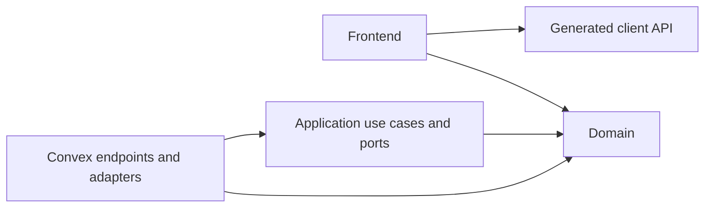
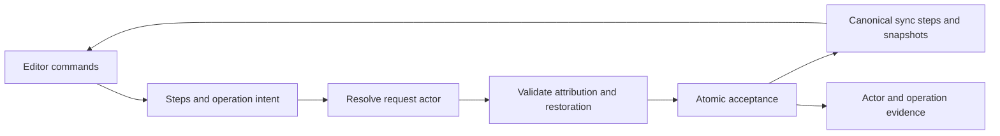

# Application architecture

This is the contract for building the application. Read it before implementation.
The app contains the framework scaffold and an evolving shared canvas feature;
the layout below applies as further features arrive. Create directories only when they contain real code.

See [Architecture decisions](architecture-decisions.md) for rationale and decision
status. Richer canvas content, long-term conflict policies, AI responsibilities,
and production deployment remain unresolved or unimplemented.
Convex Auth v1 with Google is integrated; see [Authentication](authentication.md)
for configuration and the remaining live verification.

The [shared canvas model](research/canvas-model.md) records working entity diagrams
and distinguishes agreed product direction from unresolved relationships.
The [prototype register](research/prototypes.md) defines isolated experiments for
unproven concepts before integration.

## Boundaries

The repository uses npm workspaces: `apps/frontend` owns React/Vite and
`apps/backend` owns Convex. Each app has its own package and environment files;
the root owns the lockfile and coordinating commands. The backend exports only
`@pluribus/backend/api` and type-only `@pluribus/backend/dataModel` to consumers.
`packages/core` is the dependency-free `@pluribus/core` workspace, containing canvas
domain rules, access policy, write use cases, and persistence ports.

Use hexagonal architecture: the core owns business behavior and the interfaces
it needs; adapters connect that behavior to technology. Use plain functions and
explicit dependency objects, without a dependency-injection container.

Arrows show permitted source dependencies, not network calls:

| Area                    | Location                                                                                       | Owns                                                          |
| ----------------------- | ---------------------------------------------------------------------------------------------- | ------------------------------------------------------------- |
| Domain                  | `packages/core/<feature>/domain/`                                                              | Business concepts, invariants, pure decisions                 |
| Application             | `packages/core/<feature>/application/`                                                         | Use cases and narrow port interfaces                          |
| Backend adapters        | `apps/backend/convex/<feature>/`                                                               | Persistence, identity integration, service calls              |
| Frontend                | `apps/frontend/src/features/<feature>/`                                                        | Components, integration hooks, interactions, transient stores |
| Shared domain utilities | `packages/core/shared/`, only when needed                                                      | Pure concepts with a specific shared responsibility           |
| Shared UI               | Existing `apps/frontend/src/components/`, `apps/frontend/src/hooks/`, `apps/frontend/src/lib/` | Reusable presentation code                                    |

- Domain code depends only on domain code and pure shared utilities. Application
  code depends on domain code and core-owned interfaces.
- The production core has no React, Convex, generated-type, service-SDK, or Node
  dependencies. Keep it dependency-free initially. Record a decision before
  adding a pure utility library; do not reimplement substantial algorithms merely
  to avoid a dependency.
- Adapters implement ports and invoke use cases. Construct adapters per invocation;
  never retain a Convex context in a singleton. Transactional ports must not hide
  network calls.
- The frontend uses generated client bindings, never backend implementations or
  application use cases. It may reuse domain rules for feedback; the server remains
  authoritative. Generated server helpers are not client bindings.
- Each feature owns its rules and writes. Cross-feature operations use explicit
  application interfaces supplied with adapters from the same transaction. Do not
  import another feature's persistence internals. Authorized read projections may
  join data across features.
- Shared modules must not depend on feature implementations. Do not move code into
  a shared folder merely to bypass a boundary.

## Naming

Use PascalCase for authored source filenames, retaining suffixes such as `.test.ts`
and `.d.ts`. Functions, methods and variables use camelCase; components and types
use PascalCase. Folder names stay descriptive and lowercase. Keep generated names
and framework-required filenames unchanged, including Convex `schema.ts`, `http.ts`,
`auth.ts`, `crons.ts`, configuration files and `vite-env.d.ts`.

## Clean Code

- Name functions and types for their purpose. Keep modules cohesive and separate
  decisions, orchestration, and I/O.
- Pass dependencies explicitly. Avoid mutable globals, generic repositories,
  speculative abstractions, and wrappers that only forward calls.
- Prefer precise types, straightforward control flow, and exhaustive handling of
  meaningful states. Narrow untrusted input at entry points.
- Extract shared meaning rather than coincidental similarity. Use no arbitrary
  function-length or file-size limits.
- Comments explain reasons and constraints. Tests verify observable behavior and
  important failures, not internal call sequences. Keep unrelated cleanup separate.

## Writes, reads, and contracts

Public feature APIs have one explicit entrypoint, `apps/backend/convex/<feature>.ts`.
For canvas, `Canvas.ts` declares `list`, `create`, `updateGeometry`, and `remove`;
`canvas/Handlers.ts` contains ordinary implementation functions. Keep registration
and validators in the entrypoint. Convex still derives callable names from the
filename and exports; the explicit entrypoint makes that public surface reviewable.
The frontend calls `api.Canvas.list` and the other exports through generated bindings.

`scripts/PublicApi.mjs` lists allowed public entrypoints, including infrastructure
APIs (`auth.ts`, `Users.ts`, `Health.ts`). Its type-aware architecture check rejects
public registered queries, mutations, and actions exported elsewhere, including
aliases and re-exports. Add a new feature entrypoint to that list deliberately.
Ordinary helpers and internal functions do not expose client endpoints. HTTP routes
remain explicitly registered in `http.ts`.

Registered functions retain argument and return validators. Default internal work
to internal endpoints. Read the generated Convex guidelines before backend changes.

**Business write:** a mutation validates input and derives a trusted actor. It
constructs transaction-bound persistence adapters and invokes a use case. The use
case loads current facts through ports, checks permissions and domain rules, then
writes. Keep related checks and writes in that same mutation; do not split calls
just to represent layers. Client-provided identity is never authorization.

For example, a future `rename` use case could load an item and membership through
ports, apply its name and access rules, and save through a port. The registered
mutation supplies adapters backed by its own `ctx.db`. This is an illustration,
not a product requirement or a reason to add an item table.

Business rejection throws a framework-independent exception. An adapter may
translate a recognized rejection into a safe client error, but must rethrow it.
Catching a rejection and returning normally can commit earlier writes. Unexpected
failures must not become successful responses or expose internals. Intentionally
recording a workflow's failed status is a separate operation, not a rejected write.

**Direct read:** an authorized query may use an index to return a bounded list of
permitted display fields, without inventing a repository or use case. Preserve
native pagination arguments and results. If selection or visibility requires
business policy, reuse the domain policy instead of duplicating it in the query.
Health checks and other infrastructure operations need no artificial domain layer.

Use generated API types for frontend contracts and read projections. Introduce
core-owned types only for business behavior. Preserve distinct identifier types in
the core; localize validated conversions to adapters. Map only needed fields and
keep storage metadata and provider-specific representations outside the core.

## Canvas implementation

Canvas mutations derive an actor from Convex Auth, construct transaction-bound
rectangle persistence adapters, and invoke core use cases. The current access
policy deliberately permits anonymous and authenticated participants on the one
shared canvas; it is a product policy, not an architectural exception. Future
workspace restrictions must be enforced through the same domain/application path.

`packages/core/canvas/domain/Element.ts` defines the shared `ElementBase` interface
and the `CanvasElement` discriminated union. Rectangle and Document variants retain
distinct IDs and required fields; geometry belongs to the base, while content and
lifecycle fields belong to their variant. The canvas ID is currently `"shared"`.
Adding canvases still requires an explicit ownership/access design.

Application ports derive their data contracts from these domain types and load only
what their use cases need. Backend adapters convert storage records into domain
values. Frontend `ElementProjection.ts` maps generated API results into the same
union for rendering and interactions, without storing a second editable copy.
Tables, public API shapes, text storage, and lifecycle rules remain unchanged.

Shared geometry values, bounds and validation live in `canvas/domain/Geometry.ts`;
rectangle capacity stays in the rectangle module. Frontend geometry mutations
dispatch by the captured element kind, never by the presence of generation metadata.
Each queued document gesture retains its generation; removal or generation changes
cancel pending gestures. Missing targets stop the write rather than defaulting to
a rectangle mutation.

The core owns geometry limits, capacity, and deletion/update behavior. Convex owns
storage validators, ID conversion, and native bounded read projections. The frontend
imports generated API contracts and core domain rules. Its per-canvas Zustand store
owns transient gestures, selection, and pending operations; query results are never
copied into that store. React Flow owns its local viewport.

## Routing

TanStack Router uses an explicit typed tree in `apps/frontend/src/Router.tsx`.
Read its inline style guide before adding routes. Use typed links/navigation and
route-owned search validators; avoid raw browser history updates. Components use
`getRouteApi` to avoid importing the router back into its own page dependencies.
Convex subscriptions and authorization remain outside the routing layer.

## Effects and state

Authentication is an adapter concern. Convex Auth v1 owns its schema tables,
OAuth exchange, and session lifecycle. The frontend uses `ConvexAuthProvider`;
backend reads derive the user with `getAuthUserId`, never a caller-supplied ID.
Auth internals remain outside the core. A signed-in user is not automatically
authorized for future workspace data; each feature must enforce its access rules.

The core receives time and randomness as explicit values or dependencies; it does
not read a clock, generate randomness, access the environment, or perform I/O.
Transaction retries must not repeat external effects.

Service calls belong in action-side adapters. When introducing an external effect,
record durable intent before dispatch and define duplicate handling, idempotency,
ambiguous outcomes, retries, and recovery. A timeout does not prove failure; do not
blindly resend. Several queries or mutations in an action are separate transactions.
Use supported Convex components where project guidance requires them.

For consequential queued work, define whether execution rechecks current permission
or uses recorded authorization, including what happens after revocation or deletion.
Decide this with the feature; do not build a generic workflow system now.

| State                                          | Owner                        |
| ---------------------------------------------- | ---------------------------- |
| Durable shared application data                | Convex                       |
| Shareable navigation and view selection        | URL                          |
| Transient interactions shared within a feature | Feature-scoped Zustand store |
| Isolated presentation state                    | React component              |

Unsaved drafts may remain local. Do not mirror query results into Zustand as another
source of truth. Optimistic changes must handle rejection; clear sensitive transient
state when identity or workspace changes.

## Enforcement and verification

`npm run check:architecture` scans every authored source file under `apps/frontend/src`, `apps/backend/convex`,
and `packages/core`, including unreachable files. Dependency-cruiser checks type-only imports
for boundaries and uses a separate runtime graph for cycles. Type-only cycles are
allowed. It checks edges into generated bindings but stops at generated internals.

`npm run typecheck:core` compiles all production core files in isolation with
ECMAScript libraries and no ambient browser or Node types. It explicitly skips an
empty core. Tests and helpers named `*.test.*`, `*.spec.*`, `__tests__/`, or
`test-support/` may import test tools; production code cannot import those files.

`npm test` separates core tests (Node), backend tests (edge runtime), and architecture
fixtures (Node). `npm run check` runs architecture, type checks, tests, then formatting;
`npm run build` type-checks and builds the frontend without deploying.

Checks catch dependency direction and many ambient-global errors. They cannot prove
semantic purity, feature ownership, authorization, or correct transactions. Review
these explicitly, including clock/randomness use and computed dynamic imports that
static dependency analysis cannot resolve. Do not use casts, ambient declarations,
or suppressed diagnostics to evade isolation.

For each feature, test relevant unauthorized and cross-workspace access, missing or
deleted records, rejection without partial writes, and duplicate or ambiguous
external outcomes. Use pure tests for rules and Convex integration tests for actual
authorization and transaction behavior; a fake repository alone proves neither.

Before implementation, identify affected boundaries. Update this contract and its
decision record when an accepted boundary changes. Raise consequential departures
for discussion; do not silently weaken checks. Exceptions must name the exact edge
or rule and its reason. Preserve unrelated work and report baseline failures.

## References

- [Ports and adapters](https://alistair.cockburn.us/hexagonal-architecture)
- [Convex transactions](https://docs.convex.dev/functions/mutation-functions#transactions)
- [Convex actions](https://docs.convex.dev/functions/actions)

## Collaborative documents

**Accepted ownership:** a document is a child of its canvas, represented by a
document element containing collaborative text. Canvas synchronization owns its
geometry; ProseMirror Sync owns its text. Separate storage and sync protocols are
implementation boundaries within that child, not separate user-managed objects.
Canvas is the product surface, with up to two child documents. `/document` is a
compatibility redirect to `/canvas`, with no separate page or editor loader. Removed children retain confirmed content
and geometry. Restoring advances the editing generation; older writes stay invalid.

The documents core owns identity, anonymous
access policy, and idempotent initialization through a transaction-bound port.
The adapter creates metadata and the initial component snapshot atomically.
The metadata record contains a shared lookup key and access policy; its ID also
identifies the component document. It does not duplicate editor content.

`Documents.ts` explicitly registers the native sync protocol with validators.
These are infrastructure writes: adapters apply core access policy and validate
versions, steps, and snapshot consistency before invoking ProseMirror Sync in the
same transaction. ProseMirror formats and rebasing remain outside core; no generic
content port or forwarding use case is introduced. Business operations on documents
must follow the existing core use-case rule.

Tiptap/ProseMirror owns content, selection, history, and unconfirmed steps. React
owns this editor's isolated connection/error presentation; there is no additional
shared interaction state requiring a Zustand store. Convex stores incremental
steps and occasional snapshots. Frontend and backend editor schemas must match;
schema changes need a migration. Documents currently have a 100,000-character
serialized-content limit. Server validation reconstructs content from snapshots
and bounded step batches, so long unsnapshotted histories may hit transaction limits.

Editing pauses when disconnected. Pending steps stay in memory and in-app navigation
is blocked until acknowledged; tab close warns. There is no durable offline cache.
No paragraph records or source anchors are included.

### Authorship boundary

Current-text authorship belongs to documents, independently of presence and source
connections. Contiguous text marks reference stable authors; author display metadata
is stored once. Legacy text without a mark remains unknown. Core owns a pure
restoration authorization predicate over actor, session, scope and consumed state;
there are no authorship ports yet. Mark/schema, move, inverse and mapping validation
remain editor/backend adapter responsibilities. Canvas cards activate the same
protocol with document-and-generation-scoped sessions. Concurrent card mounts
share a durable guest identity but never share an editing session. Removed cards
can render saved content without opening a writable author session. Restoring a
card opens a new session; old-generation writes and restoration proofs stay invalid.

`packages/editor` is the shared ProseMirror adapter for matching client/server
schemas and operation steps. It is deliberately technology-specific, outside the
dependency-free core, and subject to architecture checks. An authored step wraps
an ordinary ProseMirror step with an operation ID and optional restoration or move
evidence. Mapping preserves its ID; inversion references the operation being
undone. Step merging is disabled so accepted operation receipts remain identifiable.

The request adapter derives authenticated or guest-capability identity. Business
validation checks new attribution, verified restoration and explicit moves before
the sync adapter accepts the exact submitted steps. Text, attribution and required
operation evidence commit in one Convex mutation; rejection commits none of them.
Local editor history may contain unaccepted work, so it is not durable shared
history. Client acknowledgement IDs never authorize attribution.

Accepted evidence links the actor, editing session, version and inverse operation.
Undo validation maps the accepted inverse through intervening canonical steps,
including mirror mappings for undo pairs. Explicit moves require saved state and
submit a related removal/insertion pair with source evidence. Restoring a move
requires both halves atomically to prevent duplicating attributed text. Restoration
is bound to the same actor, editor session and generation; reload starts a new
session even though its evidence remains stored. Canonical component
snapshots checkpoint accepted batches; there is no second editable content table.

Reuse canonical sync history and add only missing actor/operation evidence. Reads
target indexed operations; checkpoints bound ordinary content reconstruction.
Undo reads intervening canonical steps since the restored operation, so its cost
grows with that history. This remains a prototype scaling limit. Retain prototype evidence without automatic expiry and
measure it separately from current content. UI highlights are derived presentation,
not another editable text store. Runtime/protocol proof and measured limitations
belong in the [prototype register](research/prototypes.md#current-text-authorship--accepted-experiment).

## Presence

One shared presence subsystem serves independent canvas and document contexts.
A browser guest is display identity, a tab is a session, and participation joins
that session to a stable content context. Explicit, reference-counted leases own
participation; duplicate surfaces share subscriptions and membership. Rendering a
document requires an explicit participation choice. A tab can join several contexts.

The official presence component owns membership and expiry. App records hold
participation metadata and the latest activity per channel; core validates activity
and sequence ordering. Public endpoints reapply feature access policy and require
a participation capability for writes. Guest IDs do not grant permission.
Cleanup follows expired component membership rather than deciding online status.

Roster and activity use separate queries. Each channel has one request in flight
and one replaceable pending value; clears take priority. Hidden tabs become away
and stop heartbeats; their last accepted activity remains visible until authoritative
membership expiry. Window/editor blur preserves activity. Visible idle tabs remain
present; focus is
separate from visibility. Reconnect or return creates fresh participation and drops
queued activity. Releasing one surface cannot disconnect another active lease.

Canvas/editor/browser handlers emit typed facts. The pure presence policy in
`packages/core/presence/domain/Policy.ts` owns membership intent, channel ownership,
and activity retention/clearing. The frontend registry executes lifecycle effects;
the queue coalesces publications. Editor mapping remains an adapter responsibility:
unfocused selection observations are ignored, but a focused unmappable range clears.
Pointer leave clears while focused; releasing a surface clears only its owned
channels. Convex membership expiry, rather than visibility filtering, removes remote
activity. Renderers consume those query results without another hidden-tab policy.

Canvas activity uses canvas coordinates and never changes local selection or locks
content. Text presence uses ProseMirror decorations outside content/history. It
maps versioned ranges through accepted steps and local pending steps, including
publishing at the confirmed frontier while typing. Deleted, ambiguous insertion
boundaries, and unmappable ranges hide rather than guess. New messages may reconcile
up to 256 steps; passive viewers do not write merely because text changed.

Current prototype bounds are 64 participations per context, 80 ms activity
coalescing, and 10 s heartbeats (component expiry after 25 s without renewal).
These are defaults, not measured scale guarantees. Activity queries read active
members' channel records, so fan-out cost grows with context size. Presence adds
no durable offline recovery, text anchors, or editing locks.

## Embedded document experiment

`canvasDocuments` stores canvas-owned child geometry, lifecycle and generation;
`documents` retains text metadata and a validated link back to its owning child.
The existing rectangle records and IDs stay intact. The canvas projection has
rectangle and document node variants backed by the shared core element union.
Plain data and explicit functions implement behavior; there is no base class or
generic element repository.
Canvas core use cases create/change children through transaction-bound ports.
The canvas endpoint supplies the documents feature's text-creation adapter in the
same transaction, so failed initialization leaves neither an orphan nor a card.

Every child text endpoint loads both sides of ownership and applies canvas access.
The frontend's sync ID includes its editing generation; the adapter validates it
and uses the existing component document ID. Removal and restore each advance the
generation. Text, snapshots, geometry and presence from older generations cannot
write. Authorized reads remain available for recovery; saved text stays inside the
removed canvas child, never becoming an independently managed document.

The two-child limit includes removed children. Editors stay mounted across movement,
resize, focus changes and offscreen movement. Header gestures control the canvas;
text focus owns text deletion/history. The feature Zustand store owns active-document
focus. Canvas presence remains acquired; document presence follows explicit editing.
Rendering cards alone adds no document participation or heartbeat.

Local pending edits block removal and navigation. Remote removal freezes the editor
and captures a local JSON recovery copy; this is memory-only and is lost on reload.
Users can copy it, explicitly discard it, or restore the child and explicitly open
its saved content. Old pending steps never replay into the restored generation.
A removed card remains visible as a recovery placeholder for this bounded experiment;
there is no permanent purge or general trash browser.

Canvas and document-version subscriptions report query errors without throwing
through the editor tree. They retain the last successful value for the same query
identity and pause editing until reads recover. Retained values are read-only
subscription results, not another editable store. Initial text loading is isolated
per card; the official ProseMirror Sync extension still owns the protocol. Recovery
copies and editor instances survive these query failures, but remain memory-only.
