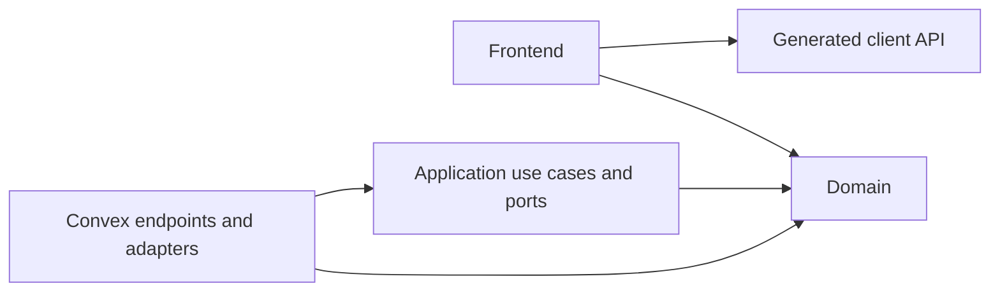

# Application architecture

This is the contract for building the application. Read it before implementation.
The app is currently a framework scaffold; the layout below applies as features
arrive. Create directories only when they contain real code.

See [Architecture decisions](architecture-decisions.md) for rationale and decision
status. Collaboration and canvas behavior, AI
responsibilities, and production deployment remain unresolved or unimplemented.
Convex Auth v1 with Google is integrated; see [Authentication](authentication.md)
for configuration and the remaining live verification.

## Boundaries

The repository uses npm workspaces: `apps/frontend` owns React/Vite and
`apps/backend` owns Convex. Each app has its own package and environment files;
the root owns the lockfile and coordinating commands. The backend exports only
`@pluribus/backend/api` and type-only `@pluribus/backend/dataModel` to consumers.
The future `packages/core` remains framework-independent and is not yet a package.

Use hexagonal architecture: the core owns business behavior and the interfaces
it needs; adapters connect that behavior to technology. Use plain functions and
explicit dependency objects, without a dependency-injection container.

Arrows show permitted source dependencies, not network calls:

| Area                    | Location                                                                                       | Owns                                                          |
| ----------------------- | ---------------------------------------------------------------------------------------------- | ------------------------------------------------------------- |
| Domain                  | `packages/core/<feature>/domain/`                                                              | Business concepts, invariants, pure decisions                 |
| Application             | `packages/core/<feature>/application/`                                                         | Use cases and narrow port interfaces                          |
| Backend adapters        | `apps/backend/convex/<feature>/`                                                               | Endpoints, persistence, identity integration, service calls   |
| Frontend                | `apps/frontend/src/features/<feature>/`                                                        | Components, integration hooks, interactions, transient stores |
| Shared domain utilities | `packages/core/shared/`, only when needed                                                      | Pure concepts with a specific shared responsibility           |
| Shared UI               | Existing `apps/frontend/src/components/`, `apps/frontend/src/hooks/`, `apps/frontend/src/lib/` | Reusable presentation code                                    |

- Domain code depends only on domain code and pure shared utilities. Application
  code depends on domain code and core-owned interfaces.
- The production core has no React, Convex, generated-type, service-SDK, or Node
  dependencies. Keep it dependency-free initially. Record a decision before
  adding a pure utility library; do not reimplement substantial algorithms merely
  to avoid a dependency.
- Adapters implement ports and invoke use cases. Construct adapters per invocation;
  never retain a Convex context in a singleton. Transactional ports must not hide
  network calls.
- The frontend uses generated client bindings, never backend implementations or
  application use cases. It may reuse domain rules for feedback; the server remains
  authoritative. Generated server helpers are not client bindings.
- Each feature owns its rules and writes. Cross-feature operations use explicit
  application interfaces supplied with adapters from the same transaction. Do not
  import another feature's persistence internals. Authorized read projections may
  join data across features.
- Shared modules must not depend on feature implementations. Do not move code into
  a shared folder merely to bypass a boundary.

## Naming

Use PascalCase for authored source filenames, retaining suffixes such as `.test.ts`
and `.d.ts`. Functions, methods and variables use camelCase; components and types
use PascalCase. Folder names stay descriptive and lowercase. Keep generated names
and framework-required filenames unchanged, including Convex `schema.ts`, `http.ts`,
`auth.ts`, `crons.ts`, configuration files and `vite-env.d.ts`.

## Clean Code

- Name functions and types for their purpose. Keep modules cohesive and separate
  decisions, orchestration, and I/O.
- Pass dependencies explicitly. Avoid mutable globals, generic repositories,
  speculative abstractions, and wrappers that only forward calls.
- Prefer precise types, straightforward control flow, and exhaustive handling of
  meaningful states. Narrow untrusted input at entry points.
- Extract shared meaning rather than coincidental similarity. Use no arbitrary
  function-length or file-size limits.
- Comments explain reasons and constraints. Tests verify observable behavior and
  important failures, not internal call sequences. Keep unrelated cleanup separate.

## Writes, reads, and contracts

Registered functions retain argument and return validators. Default internal work
to internal endpoints. Read the generated Convex guidelines before backend changes.

**Business write:** a mutation validates input and derives a trusted actor. It
constructs transaction-bound persistence adapters and invokes a use case. The use
case loads current facts through ports, checks permissions and domain rules, then
writes. Keep related checks and writes in that same mutation; do not split calls
just to represent layers. Client-provided identity is never authorization.

For example, a future `rename` use case could load an item and membership through
ports, apply its name and access rules, and save through a port. The registered
mutation supplies adapters backed by its own `ctx.db`. This is an illustration,
not a product requirement or a reason to add an item table.

Business rejection throws a framework-independent exception. An adapter may
translate a recognized rejection into a safe client error, but must rethrow it.
Catching a rejection and returning normally can commit earlier writes. Unexpected
failures must not become successful responses or expose internals. Intentionally
recording a workflow's failed status is a separate operation, not a rejected write.

**Direct read:** an authorized query may use an index to return a bounded list of
permitted display fields, without inventing a repository or use case. Preserve
native pagination arguments and results. If selection or visibility requires
business policy, reuse the domain policy instead of duplicating it in the query.
Health checks and other infrastructure operations need no artificial domain layer.

Use generated API types for frontend contracts and read projections. Introduce
core-owned types only for business behavior. Preserve distinct identifier types in
the core; localize validated conversions to adapters. Map only needed fields and
keep storage metadata and provider-specific representations outside the core.

## Routing

TanStack Router uses an explicit typed tree in `apps/frontend/src/Router.tsx`.
Read its inline style guide before adding routes. Use typed links/navigation and
route-owned search validators; avoid raw browser history updates. Components use
`getRouteApi` to avoid importing the router back into its own page dependencies.
Convex subscriptions and authorization remain outside the routing layer.

## Effects and state

Authentication is an adapter concern. Convex Auth v1 owns its schema tables,
OAuth exchange, and session lifecycle. The frontend uses `ConvexAuthProvider`;
backend reads derive the user with `getAuthUserId`, never a caller-supplied ID.
Auth internals remain outside the core. A signed-in user is not automatically
authorized for future workspace data; each feature must enforce its access rules.

The core receives time and randomness as explicit values or dependencies; it does
not read a clock, generate randomness, access the environment, or perform I/O.
Transaction retries must not repeat external effects.

Service calls belong in action-side adapters. When introducing an external effect,
record durable intent before dispatch and define duplicate handling, idempotency,
ambiguous outcomes, retries, and recovery. A timeout does not prove failure; do not
blindly resend. Several queries or mutations in an action are separate transactions.
Use supported Convex components where project guidance requires them.

For consequential queued work, define whether execution rechecks current permission
or uses recorded authorization, including what happens after revocation or deletion.
Decide this with the feature; do not build a generic workflow system now.

| State                                          | Owner                        |
| ---------------------------------------------- | ---------------------------- |
| Durable shared application data                | Convex                       |
| Shareable navigation and view selection        | URL                          |
| Transient interactions shared within a feature | Feature-scoped Zustand store |
| Isolated presentation state                    | React component              |

Unsaved drafts may remain local. Do not mirror query results into Zustand as another
source of truth. Optimistic changes must handle rejection; clear sensitive transient
state when identity or workspace changes.

## Enforcement and verification

`npm run check:architecture` scans every authored source file under `apps/frontend/src`, `apps/backend/convex`,
and `packages/core`, including unreachable files. Dependency-cruiser checks type-only imports
for boundaries and uses a separate runtime graph for cycles. Type-only cycles are
allowed. It checks edges into generated bindings but stops at generated internals.

`npm run typecheck:core` compiles all production core files in isolation with
ECMAScript libraries and no ambient browser or Node types. It explicitly skips an
empty core. Tests and helpers named `*.test.*`, `*.spec.*`, `__tests__/`, or
`test-support/` may import test tools; production code cannot import those files.

`npm test` separates core tests (Node), backend tests (edge runtime), and architecture
fixtures (Node). `npm run check` runs architecture, type checks, tests, then formatting;
`npm run build` type-checks and builds the frontend without deploying.

Checks catch dependency direction and many ambient-global errors. They cannot prove
semantic purity, feature ownership, authorization, or correct transactions. Review
these explicitly, including clock/randomness use and computed dynamic imports that
static dependency analysis cannot resolve. Do not use casts, ambient declarations,
or suppressed diagnostics to evade isolation.

For each feature, test relevant unauthorized and cross-workspace access, missing or
deleted records, rejection without partial writes, and duplicate or ambiguous
external outcomes. Use pure tests for rules and Convex integration tests for actual
authorization and transaction behavior; a fake repository alone proves neither.

Before implementation, identify affected boundaries. Update this contract and its
decision record when an accepted boundary changes. Raise consequential departures
for discussion; do not silently weaken checks. Exceptions must name the exact edge
or rule and its reason. Preserve unrelated work and report baseline failures.

## References

- [Ports and adapters](https://alistair.cockburn.us/hexagonal-architecture)
- [Convex transactions](https://docs.convex.dev/functions/mutation-functions#transactions)
- [Convex actions](https://docs.convex.dev/functions/actions)
