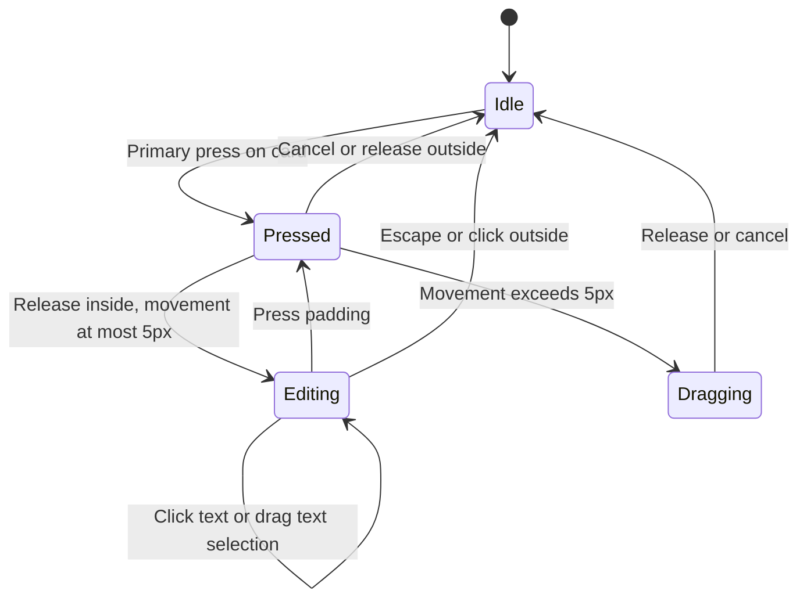
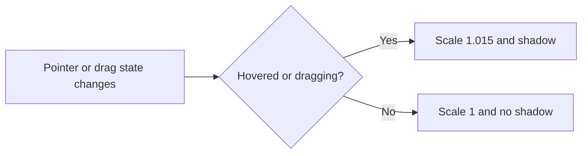

# Canvas behavior

Agreed behavior, not a description of whatever the code currently does. Update
when a behavior decision changes; flag implementation mismatches instead of
rewriting the spec to match them. Unspecified behavior remains undecided.

**C1 — Navigation:** Two-finger trackpad movement pans and pinch zooms over the
background or any element, including document text, whether selected or editing.

## Canvas background

The canvas has no header toolbar, theme picker or interaction-hint row. Workspace navigation remains in the workspace header.

- **C2 — Local view:** Pan, zoom, selection and theme are personal. Element geometry and document text are shared.
- **C3 — Minimap:** A theme-aware overview in the lower-right shows document bounds and the current viewport. Dragging the overview pans and scrolling over it zooms the local viewport; document geometry and content are unchanged.

| Event                        | Condition                         | Behavior                               |
| ---------------------------- | --------------------------------- | -------------------------------------- |
| **Mouse / trackpad**         |                                   |                                        |
| Click                        | Background, no selection modifier | Clear selection and exit text editing. |
| Two-finger trackpad movement | Pointer over background           | Pan the viewport.                      |
| Pinch                        | Pointer over background           | Zoom the viewport.                     |

Primary-button drag on empty background draws a marquee; intersecting cards are selected.
Space-drag or middle-button drag pans. The native browser context menu is suppressed throughout the canvas, its cards and its custom context menu. Right-click the background opens the card-creation menu; Shift+F10 or the Context Menu key opens it at the canvas center when the canvas is focused. Document cards are created at that canvas position; Web Page creation retains it while URL/prompt are entered. Escape/outside click dismisses the menu. Toolbar create/delete buttons are omitted; Delete/Backspace removes selected cards. Shift-click toggles an element in the
selection without entering document editing; inside an active editor, Shift-click
keeps its normal text-selection behavior. Double-click behavior remains undecided.

## Shared element rules

- **E1 — Geometry:** Each element has one saved position and size. Drag/resize previews and animation are temporary; the settled geometry persists after reload.
- **E2 — Alignment:** Movement snaps edges and centers independently on each axis. Only targets intersecting the current viewport plus a 160-screen-pixel margin are eligible, rechecked while moving. Facing edges also snap to a 24-canvas-pixel gap when their perpendicular spans overlap; this applies to movement and resizing without visual guidelines. Group snapping preserves member spacing. Resize snapping changes only the moving edges and respects size constraints.
- **E3 — Snap feedback:** Do not display alignment or spacing guidelines on the canvas. Snapping remains active. Alt/Option bypasses snapping immediately. Snap feedback clears on release, cancellation or disconnect; target positions remain fixed during a gesture.
- **E4 — Motion:** Snap acquisition and release animate smoothly alongside short drag smoothing. Respect reduced motion. Current tuning: acquire within 6 screen pixels, release beyond 10, ease over 140ms regardless of zoom.
- **E5 — Lifted:** Hovered or dragged elements scale to 1.015 with a subtle shadow. Stay lifted while either condition holds; return to rest when neither holds. This is visual only: saved geometry and snap targets do not change. Transition over 140ms; reduced motion removes the transition.

- **E6 — Translation:** Element movement interpolates visually over 50ms; selected elements show no boundary box or visible resize handles; document focus does not add a colored border. Collaborator cursors play an 80ms buffer of receive-timestamped positions on animation frames. Pointer publishing targets 40ms between send starts with one request in flight and latest-only pending data. First appearance is immediate; no extrapolation, and gaps over 500ms reset the path. Reduced motion bypasses buffering. Saved geometry is unchanged.

## Presence

- **P1 — Browser ownership:** One publisher follows the newest focused eligible tab
  across same-origin tabs/windows. Followers retain reads and hide their own browser's
  activity from collaborator overlays. Other browser profiles/devices remain separate.
- **P2 — Retention:** Ordinary blur and visible idleness preserve accepted activity.
  Unfocused pages ignore new interaction observations. Hidden owners stop heartbeats;
  activity disappears on membership expiry or a newer tab's ownership claim.
- **P3 — Recovery:** Failed updates retry with capped backoff; newer channel state
  replaces older pending state. Handoff fences old writes/clears and starts fresh
  participation. Account changes require a new claim; legacy tabs must reload.

Verification: policy, registry and backend tests pass for ownership/retention/retries.
Real browser focus/handoff remains unverified; a disposable fixture timed out.

## Supported elements

Each canvas supports up to 100 active document cards. Removed cards and reply panel documents do not count toward this cap. Creation and restoration both enforce the cap.

Document cards, workspace Web Pages, and workspace Images are active spatial elements. Images are dropped from local files onto the canvas, display an immediate preview with upload progress, and become shared cards after file validation. Failed uploads remain local with Retry and Remove. PNG, JPEG, GIF and WebP files up to 10 MB are accepted; up to 100 active Image cards are supported separately from documents and Web Pages. Images move, resize, select, delete and restore through Element History. Their stored files remain available when a card is removed for Undo. The public shared canvas does not accept image uploads.

New Image cards start at the source image's aspect ratio where that ratio fits within canvas size limits. Existing cards keep their saved geometry. An AI description is generated after upload when the model is available; a failure does not block the card.

Workspace-wide MCP agents may create Document and Web Page cards, set the full
geometry of existing Document, Web Page and Image cards, and delete those cards.
The same size, capacity, lifecycle and conditional Element History rules apply.
Agent geometry is a direct saved value; browser-only snapping and animation do
not apply. Agent geometry commands compare the card's current saved geometry
with the value the agent read before changing it. Image creation still requires
an upload, and reply documents are not spatial card targets.

In a private workspace, a dropped browser image/link checks the remote response. A supported image becomes an Image card; an HTML or text page becomes a Web Page card and follows its normal capture flow. A checking draft appears at the drop point; failed checks can be retried or removed. Direct URL imports reject private destinations, redirects, unsupported formats and images over 10 MB.

Rectangles are retired: no
creation, rendering, selection, movement, deletion, paragraph linking or agent
context. Existing rectangle rows and historical receipts remain stored. Legacy
requests and Undo/Redo cannot revive or mutate them; old rectangle-containing
agent contexts require a fresh selection before reading or applying edits.

## Element History

When disconnected, dragging, resizing and deletion cannot change shared elements.

Canvas Undo/Redo uses keyboard shortcuts (Cmd/Ctrl+Z, Cmd/Ctrl+Shift+Z or Ctrl+Y); no canvas Undo/Redo buttons are shown. History errors and Retry action remain available when needed.

Undo/Redo outside text inputs applies personal Element History: one entry per
created or deleted Element, or per move/resize gesture (including a group drag). Geometry
Undo/Redo changes the whole group only if every member still matches the expected
geometry and verified session continuity; otherwise it changes nothing and retires that entry.
Own delete/restore cycles preserve earlier History; another session’s lifecycle
changes invalidate it. Live gestures always retain their original write generation.

Dragging a selected element moves the entire selection, including mixed Document,
Web Page and Image cards, preserving relative spacing. Delete or Backspace outside editors/inputs removes the selected elements. Pending
text blocks the whole deletion before it starts; disconnect/busy guards apply.
Deletion retains one History entry per element; a failure can leave a partial
result and stops subsequent deletions. Group movement remains one History gesture.

Undecided: double-click and keyboard movement.

## Reply document panel

Reply drafts open their collaborative editor from an inbox thread. Closing or switching panels keeps a draft editor mounted so pending text survives. Retired main documents remain stored for older workspaces but have no navigation or editor surface.

All rich-text editors show a compact floating menu for a non-empty text selection while editing. It offers bold, italic and a dropdown of Text and Heading 1–3 presets; it closes when the selection collapses. Formatting uses the existing editor session and is unavailable when editing is paused.

## Document cards

- **D1 — Content:** Text directly on the card: no title bar, persistent formatting toolbar or inset editor surface. A floating formatting menu appears for selected text while editing. Content may contain headings, lists, links and other text formatting. Do not display loading placeholders or routine status text inside cards; actionable recovery controls remain available.
- **D4 — Authorship color:** Canvas Note cards render other authors' text in a stable color per author, including while not editing. The current viewer's own text and unattributed legacy text use the normal text color. Hovering attributed text, including one's own, shows the resolved author name. The colors adapt to light and dark themes and do not change stored document content. Other editor surfaces retain their existing optional authorship highlight.
- **D0 — Initial size:** New Note cards start 300×300 and can resize freely; their aspect ratio is not locked.
- **D2 — Interaction:** Outside editing, press without Shift anywhere on a card; release within 5 screen pixels to edit at that position, or move beyond 5 pixels to drag. Once dragging, returning to the start does not turn it into a click. While editing, text drag selects text; padding drag moves the card. Escape or clicking outside exits editing. Moving the card must not remount its editor or lose unsaved text.
- **D3 — Height:** Minimum height fits rendered content plus padding. Users can make the card taller without a fixed height cap. Overflowing new text grows the card; spare height is preserved. Deleting text does not automatically shrink it. Width changes must also respect the content minimum.

| Event                              | Condition                                                             | Behavior                                                                                  |
| ---------------------------------- | --------------------------------------------------------------------- | ----------------------------------------------------------------------------------------- |
| **Mouse / trackpad**               |                                                                       |                                                                                           |
| Pointer enters                     | Over element, including document text                                 | Enter Lifted state.                                                                       |
| Pointer leaves                     | Not dragging                                                          | Return to resting appearance.                                                             |
| Drag starts / ends                 | Element dragging                                                      | Stay Lifted during drag; on release remain Lifted only if hovered.                        |
| Two-finger trackpad movement       | Pointer over card, including text while editing                       | Pan the viewport.                                                                         |
| Pinch                              | Pointer over card, including text while editing                       | Zoom the viewport.                                                                        |
| Pointer down                       | Idle card or padding while editing; primary button; editable          | Enter Pressed; defer editing. Resize controls and action buttons keep their own behavior. |
| Pointer release                    | Pressed; movement never exceeded 5 screen pixels; release inside card | Enter Editing and place caret at release position.                                        |
| Pointer moves                      | Pressed; exceeds 5 screen pixels                                      | Enter Dragging; move card with snapping.                                                  |
| Pointer cancel / lost window focus | Pressed or dragging                                                   | Clear pending click intent; never enter editing from this press.                          |
| Click text                         | Already editing                                                       | Place caret using normal editor behavior.                                                 |
| Drag text                          | Already editing                                                       | Select text; do not move the card.                                                        |
| Drag padding                       | Editable                                                              | Move with snapping; preserve spacing when moving a selected group.                        |
| Drag resize control                | Selected and editable                                                 | Resize moving edges with snapping; content minimum takes precedence.                      |
| Release drag                       | Dragging                                                              | Save settled geometry; clear guides; return Idle without entering editing.                |
| **Keyboard**                       |                                                                       |                                                                                           |
| Escape                             | Editing; not composing text                                           | Exit editing; keep the card selected.                                                     |
| Press / release Alt or Option      | Moving or resizing                                                    | Bypass / resume snapping immediately.                                                     |
| Type, paste or Enter               | Editor focused and editable                                           | Edit content; grow the card if content exceeds available height. Preserve spare height.   |
| Delete / Backspace                 | Editor focused and editable                                           | Delete text; do not delete or automatically shrink the card.                              |
| Delete / Backspace                 | Card selected; focus outside a text input/editor                      | Delete selected element(s).                                                               |
| Undo / Redo                        | Focus outside a text input/editor                                     | Apply personal Element History for creation, deletion, movement and resizing.             |
| Undo / Redo                        | Editor focused                                                        | Use editor history; do not invoke card-deletion history.                                  |

When disconnected, pause shared edits, movement, resizing and deletion; retain pending local text.
Reconnection preserves the editor selection; only a new click-to-edit request places the caret from pointer coordinates.
Confirmed text synchronization clears prior sync errors. Snapshot maintenance failures do not imply saved text is pending.
Temporary canvas interaction locks must not show document-sync warnings or shift card content.

Undecided: card double-click behavior and keyboard movement.

### Document interaction flow

Resize controls bypass this flow. Disconnect prevents entry into editing or movement;
pending click intent is canceled. The editor remains mounted in every state.

### Lifted appearance (independent of editing)

Selected editable rectangles and cards show resize controls. Exact control styling
remains provisional; the custom corner-handle prototype was rejected. For either
element, cancellation or disconnect clears alignment guides (E3).

## Latest focused verification (2026-09-21)

- **C3 — Pass (browser):** Built-in minimap visible in the lower-right with dark-theme colors. Dragging changed viewport translation; scrolling changed scale from 1 to 2.71321. Both document node styles and text remained identical. Light-theme visual review: **not checked**.

- **D1/D2 — Pass (drag status):** Browser drag/release showed no document status message and preserved editor identity and text. Test geometry was restored with Undo. Projection tests distinguish interaction locks from read failures and verify recovery from both.

- **Document editor — Pass:** Browser disconnect/reconnect preserved selection, editor identity and text; a new click still repositioned the caret. An isolated browser harness using the actual hook verified saved-text error suppression, pending-error visibility, automatic recovery, metadata-copy reuse and acknowledgment cleanup. Physical network loss and backend snapshot failure injection were not checked.

- **V2 History — Pass (browser + tests):** Create → move → delete → Undo all → Redo all restored exact rectangle geometry. A second session’s rectangle move prevented the first session’s Undo without changing peer geometry. Temporary rectangles removed. Backend tests cover both Element types, receipt replay after peer changes, lineage, legacy isolation, capacity and maximal groups. Queue tests cover cancellation, uncertain acknowledgements, disposal and idle closure. Physical offline/suspension and document creation UI were **not checked** in this run.
- **Verification incident:** An initial coordinate-based peer drag targeted a document; Undo was refused after an intervening geometry change. Read-only local History inspection confirmed subsequent document moves superseded that drag; their newer state was left intact. Subsequent checks explicitly selected the test rectangle.

- **Creation History — Pass:** Local browser Add rectangle → Undo → Redo → Undo passes against the running backend; the test Element was removed. Backend tests cover both Element types, identity restoration, capacity rejection, ownership and exact retries. Document creation UI was **not checked** because both user document slots were occupied; existing documents were preserved.

- **Move/resize History and E1 — Pass (browser):** Rectangle move and resize restore exact position/dimensions through Undo/Redo. A group drag restores both members with one Undo. Document resize Undo restores geometry and preserves text. A second client's later move prevents Undo without changing that geometry. Test rectangles were removed; document geometry was restored. Backend/queue tests cover atomic groups, no-ops, retries, interrupted publication and stale generations. Physical offline transitions and additional text-growth stress cases were **not checked** in the browser.

- **Element deletion History — Pass:** Local browser rectangle Delete/Undo/Redo passes with buttons and keyboard. Backend tests cover both types, receipt ownership, capacity, identity/content restoration and stale generations; frontend tests cover mixed ordering and exact retries. Mixed-selection browser gestures and offline transitions were **not checked** in this run.
- **E1 — Pass (backend tests):** Undo preserves geometry; old-generation movement is rejected after restoration. The move/resize browser evidence above covers the extended History path.

- **E6 — Pass (browser):** Drag frames interpolate over 50ms and settle at target coordinates. Buffered cursor verification (2026-09-20, local two-tab run): 16 received updates, 39.9ms mean interval, 37 moving frames, and final position within 0.01 canvas units of target. This is a local sample, not a network-wide latency guarantee. Timeline and queue tests cover irregular arrivals, stopping, stale samples, resets and backpressure.

- **E5 — Pass (browser):** Document hover scales to 1.015 with shadow without changing node geometry; pointer exit restores scale 1. Rectangle dragging stays lifted and returns to rest afterward. Reduced motion removes transitions.
- **C1 — Pass (browser events):** Pan and pinch wheel events change the viewport over background, rectangles and focused document text. Browser wheel input also pans over the editor. Physical trackpad gestures: **not checked**.
- **D2 — Pass (browser + 4 gesture tests):** Holding does not edit; release focuses the clicked position. Dragging from idle text moves the card without editing on release; editor identity survives. Editing text drag selects without moving. Padding click, Escape, outside click and cancellation pass. Test movement was restored and text was unchanged.

## Check changes against this spec

Before canvas/element work, read the affected rules. Afterward, report **pass**,
**mismatch**, or **not checked** for those rules, with evidence. Code inspection
alone does not establish that a browser interaction works.

- Navigation: try trackpad pan and pinch.
- Geometry/snapping: drag, group-drag and resize; confirm no guidelines appear; check Alt, reduced motion, multiple zoom levels and reload. Use focused geometry tests for constraints.
- Documents: edit, select text and drag padding; resize to minimum, add a line, add spare height, delete text and narrow the card.

Run only the checks affected by the change. Record remaining gaps explicitly;
do not claim complete conformance from passing unit tests alone.

- **Document capacity — Pass (2026-09-21):** Backend regressions cover 100 visible cards, rejection of card 101, deletion freeing capacity, blocked/restored Undo and a 100-card History group. Browser confirmed Add document enabled with the two existing cards. Rendering performance with 100 live editors was **not checked**.

## Web Pages

- **W1 — Capture:** In a private workspace, Add web page accepts a public HTTP(S)
  URL and a separate What to extract field in a local input card at the clicked canvas position.
  Instructions are optional natural language, including desired format or column names.
  No separate extraction format or column inputs are shown. Without instructions,
  capture page content; with instructions, infer useful text/table shape and columns
  server-side, honoring names given in prose. Format-only instructions are accepted.
  Existing Sources editing uses the same form and deliberately clears legacy explicit
  table settings when resubmitted; refresh preserves the current request configuration.
  Existing captures/provenance remain unchanged until successful replacement.
  Fetch creates the shared source; Escape before submission dismisses the local draft.
  Fetching shows a pink/purple Paper MeshGradient with a centered globe and label.
  Motion pauses offscreen, in hidden tabs and for reduced-motion preferences.
  Ready cards show Web Content, title, URL and preview without footer controls.
  Only the Details button opens the full read-only capture sheet; it is hidden during Fetching. Title and screenshot clicks do not open the sheet. Failed and overdue captures retain recovery controls there.
  Failed cards retain a details/retry action.
- **W2 — Refresh:** Keep the last successful capture visible on the card and in the full panel while refreshing and after a
  failed refresh. Replace it only on successful current-revision completion.
  Retain the capture URL, prompt and timestamp as backend provenance, without showing the extraction prompt or Captured line in Details. Retry uses the subscribed request revision; conflicts require review or waiting, never automatic replacement. The ready-state Refresh button is removed.
  The details panel offers explicit Stop waiting for overdue or legacy busy requests.
  Recovery never fetches automatically; Retry is a separate action after failure.
  Missing deadlines are not labeled as confirmed timeouts.
- **W3 — Geometry:** Web Pages share selection, alignment, movement and resize
  behavior with other Elements. New cards start at 300×176. Minimum size is 300×132; maximum is 2000×2000.
- **W4 — Lifecycle:** Workspace capacity is 20 active Web Pages, separate from
  100 documents. Creation, move/resize and deletion use Element History. Delete
  hides the source and frees its slot; Undo restores its identity, geometry and
  capture if capacity permits. Deletion cancels in-flight captures; restoration
  never starts an automatic fetch.
- **W5 — Source material:** A retained successful capture remains available after
  refresh failure. Capture bodies are source material, never collaborative documents.

- **W6 — Capture rendering:** The full panel preserves both captured Markdown and
  extraction JSON. Render paragraphs, headings, lists, safe links, code and Markdown
  tables. Explicit CSV/JSON fences render supported flat tables amid surrounding text.
  Auto CSV detection is conservative; View as can select CSV/JSON or Text/Markdown.
  Flat JSON record arrays become tables; nested or unsupported JSON stays raw.
  Valid empty results show No matches returned; malformed structured data shows a
  parse message plus raw text. Original response exposes both unchanged fields.
  Structured tables show at most 100 rows (with a notice); over 30 columns stays raw.
  Marked inferred captures render validated text/context and ordered table rows; malformed
  envelopes fall back to raw data with an error. Legacy schema-backed captures still
  use saved capture columns and validated rows, never the
  latest pending request schema. Compact previews omit layout/navigation/fenced data
  conservatively; when nothing useful remains, offer Open capture, not a no-data claim.
  Table cards show captured column names and open the full rows in the panel.
  Canvas previews never diagnose truncated JSON/CSV. Raw HTML is not executed and
  images embedded in captured Markdown are not loaded.

- **W7 — Screenshot:** Show the accepted capture's above-the-fold screenshot in
  the card and full panel. The image is always stacked above the text, including in short cards. The preview area matches the captured viewport's 8:5 aspect ratio. Cards grow to fit their content without internal scrolling; resizing cannot make
  them shorter than their content. Content-driven height changes animate over180ms;
  manual resizing is direct, and reduced motion disables the transition. Refreshing or failed refresh keeps the previous capture and image together.
  A new successful capture without an image shows Preview unavailable; it never
  borrows the previous image. Legacy captures without screenshot metadata omit the
  image area. Loading and broken images retain readable text and an accessible fallback.

Verification: backend tests cover authorization, atomic creation/History, bounded
previews, refresh retention, late results, separate capacity and mixed-element Undo.
Integrated browser acceptance is tracked separately from those tests.

PM integrated verification passed Add → Fetching → Captured, full capture viewing,
and Delete/Undo/Redo with exact retained content. Live drag/resize remains not checked.
Web Page selections support the existing saved-paragraph link operation.

PM live follow-up: marquee selected two newly created disposable Document Cards;
Delete selected(2) removed both, two Undo restored both, and two Redo removed both.
Only the two test IDs were selected/deleted. Original user cards were unchanged.

Web Page redesign verification (2026-09-22): **W1 pass in disposable browser preview**
for input, fetching shader, ready output and failure recovery. **W3 pass in domain tests**
for compact geometry bounds. Full check and build pass. Live authenticated creation,
trackpad gestures and resizing with the redesign: **not checked**.

Recovery integration verification (2026-09-22): **W2 pass in mocked browser preview**
for retained content, original provenance, explicit recovery, separate Retry and
revision conflict feedback. No live provider or deployed-runtime check was performed.

Structured rendering verification (2026-09-22): **W6 pass** in 12 parser/render
regressions and disposable browser checks, independently reviewed by PM. Covers
mixed prose/tables, CSV override, empty versus malformed, nested raw, original
fields, safe links/HTML and bounded previews. Full check255tests/build pass.

Earlier explicit-column experiment (superseded by instruction-only W1): **pass** in shared validation,
17 focused frontend regressions and PM-accepted disposable browser checks for
format-only rejection, explicit columns, stored capture order and neutral fallback.
Integrated tests282/one skipped, architecture/types/build passed; formatting correction
handled by backend owner. Live extraction quality was not checked.

Instruction-only verification (2026-09-22): **W1/W6 pass** in 20 focused frontend
regressions and PM browser acceptance for URL/instructions-only submission,
format-only prose acceptance, and marked inferred text/context/ordered tables.
Full check passes301tests/one skipped, architecture/types/format. Existing explicit
column form is superseded; legacy capture rendering and raw originals remain.
No live provider or inferred semantic-quality check was performed.

Screenshot verification (2026-09-22): **W7 pass** in 11 focused screenshot/content
tests and PM-reviewed disposable browser fixtures for compact/tall cards, panel
image and broken-image fallback. Fixtures use an authored sample image; live
provider screenshot capture and authenticated workspace behavior are not checked.

Document cards start at300px wide and cannot be resized narrower, matching Web Page cards. Existing saved widths remain unchanged.

Within24 screen pixels of a potential spacing snap beside another element, show a
soft destination shadow for each moving element before the6px snap threshold. Edge/center alignment alone shows no outline.
Hide it outside snap range, on Alt/Option bypass, release, cancellation or disconnect.
The preview sits beneath the card layer, ignores pointer input, and does not introduce alignment guidelines.

Selected-element context menu:

| Modality       | Event                                      | Behavior                                                                                                                                      |
| -------------- | ------------------------------------------ | --------------------------------------------------------------------------------------------------------------------------------------------- |
| Mouse/trackpad | Right-click selected card                  | Keep selection; show Delete for one or Delete All and Arrange for multiple.                                                                   |
| Mouse/trackpad | Right-click unselected card                | Select that card alone and show its menu.                                                                                                     |
| Keyboard       | Context Menu key / Shift-F10               | Open the selected-element menu when a selection exists.                                                                                       |
| Menu           | Arrange → Grid / Horizontally / Vertically | Preserve sizes; order top-to-bottom then left-to-right; use24px gaps, with grid columns sized for their widest card. One undoable group move. |

Delete uses existing element History and permissions. Menus close on action, dismissal or viewport movement.

Arrange → Masonry uses ceil(sqrt(selection count)) columns, placing each card in
the shortest column (ties go left). Preserve sizes; size each column to its widest
assigned card, with24px gaps. The layout is one undoable group move.

Card styling: Document, Web Page and Image cards share16px padding/corners, a1px
neutral border, the theme overlay surface,14px body text,12px metadata and8px
media corners. All use the same hover/drag lift and reduced-motion behavior.

Collaborator activity is always visible. Participants appear as32px avatar circles
with8px overlap; accessible names and hover titles identify people, self, activity
status and grouped tabs. Agent avatars retain their recently-active distinction.

Canvas presence avatars float at the top-left of the viewport, outside scene transforms.
They reserve no layout row; empty overlay space does not intercept canvas input.

Image cards are edge-to-edge images without padding, border or filename captions.
Images cover the card without distortion (cropping when aspect ratios differ).
Accessible names remain; upload/retry status overlays remain on draft images.

Image click/release opens a modal lightbox; dragging or Shift-click does not.
Enter/Space on the image also opens it. Animate from card bounds to a viewport-fit
image over240ms, preserving proportions; Escape or backdrop click reverses it.
Trap focus while open and restore it to the image on close; respect reduced motion.

Canvas load: cards pop in over450ms on mount, scaling from0.88 through1.025 to1 (reduced motion skips it).
Remember the viewport center and zoom per workspace in local storage. Missing,
invalid or unavailable storage frames the existing cards at up to 100% zoom;
an empty canvas uses the default view. The prior paper-centered view is not
restored. Opening an inbox draft does not change the canvas viewport.

Each card samples a0–180ms entrance delay once per mount; rerenders keep it stable.
Reduced motion bypasses both entrance animation and delay.

Releasing a drag while its destination shadow is visible commits that exact
preview geometry as the final position. Alt/Option bypass and cancellation do not.

Snap shadows fade/scale in and out over140ms. Exit retains only a noninteractive
visual ghost; it is no longer a snap target. Reduced motion skips the transition.

Editable cards expose resize grips near each edge or corner, without requiring selection. Only the nearby side bar or corner dot appears; it fades and scales in and out over 180ms as the pointer enters or leaves. Reduced motion removes the animation. Existing size constraints and resize History still apply.
