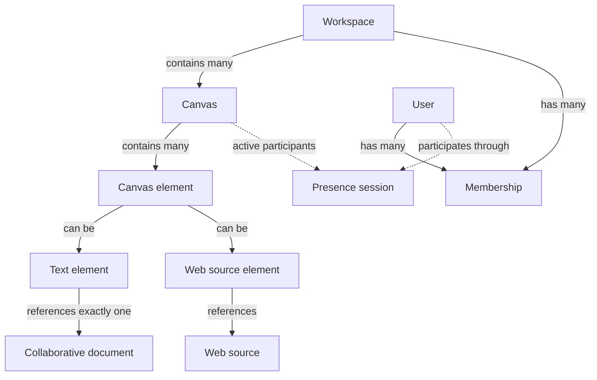
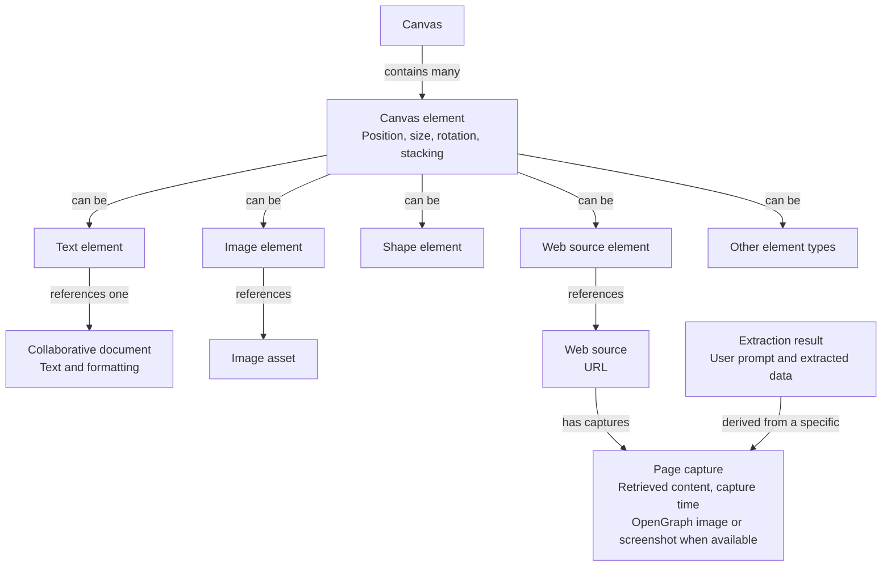

# Shared canvas model

Working entity diagrams from the architecture discussion, recorded 2026-09-14.
These describe product concepts and relationships, not database tables or an
implemented schema. See [Provisional vocabulary](vocabulary.md) and the
[architecture contract](../architecture.md).

The [prototype register](prototypes.md) tracks experiments to validate content
anchors, AI updates, and synchronization before these concepts are combined.

## Entity hierarchy

A canvas contains multiple elements, including text and non-text content.
The proposed v1 model gives each text element its own collaborative document.
A document may hold just a few words; it does not imply a separate page.

Membership connects a user to a workspace and its permissions. Workspace remains
a proposed outer container; projects, files, and pages are not established layers.
Dashed arrows show temporary participation rather than durable content ownership.

## Element kinds and content

Canvas element is the general concept; text element is one kind. The branches
below represent alternatives, not additional containers within an element.
Images and shapes illustrate possible kinds, not a committed v1 feature list.

Placement belongs to the canvas element; content belongs to its specific kind.
Moving a text element and editing its text affect separate state and should both
survive concurrent activity. Text uses the selected Convex ProseMirror Sync
direction; this document does not introduce an integration.

## Web source element

Web source element is the working name for a URL brought onto the canvas. The
intended Firecrawl integration retrieves the page for a preview and can extract
data according to a user prompt. The source, dated capture, and extraction result
are distinct concepts but may appear together in one card.

The proposed first version imports one page, with an OpenGraph preview when
available and a screenshot option when layout matters. Keep the URL usable if
retrieval fails. Loading, failure, retry, and explicit refresh behavior remain
part of the proposed flow. An extraction records which capture it used; refreshing
a source must not silently overwrite a document someone has developed from it.

Firecrawl belongs behind a backend adapter, outside the domain model. The
diagrams describe the intended feature, not an installed integration.

## Decisions and open questions

- **Agreed direction:** canvases contain multiple text and non-text elements;
  v1 is online-only and supports simultaneous editing of the same text.
- **Proposed v1 relationship:** one collaborative document per text element.
  Reusing one document across multiple placements remains a separate decision.
- **Open:** exact non-text element kinds, workspace access rules, and whether
  deleting an element also deletes its content or only removes its placement.
- **Working direction:** a Web source element supports URL previews and
  prompt-based extraction. Its name, capture retention, and whether extraction
  results can become separate editable elements remain open.
- **Open:** connectors relate elements and groups contain elements; define their
  behavior before treating them as ordinary positioned content.

Presence represents cursors and selections, not document content. Session
lifecycle, deletion, and permission changes must coordinate across canvas, text,
and presence. Their separate synchronization flows do not imply one transaction.
