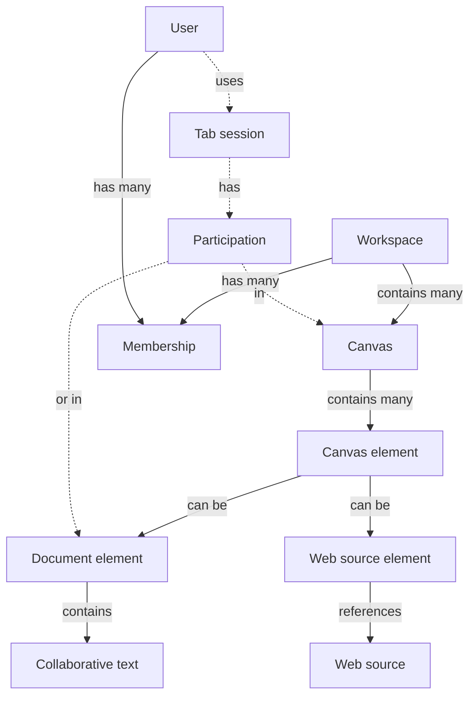
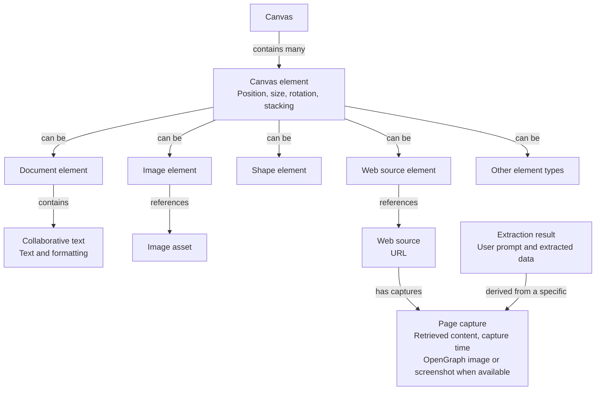

# Shared canvas model

Working entity diagrams from the architecture discussion, recorded 2026-09-14.
These describe product concepts and relationships, not database tables or an
implemented schema. See [Provisional vocabulary](vocabulary.md) and the
[architecture contract](../architecture.md).

The [prototype register](prototypes.md) tracks experiments to validate content
anchors, AI updates, and synchronization before these concepts are combined.

## Entity hierarchy

A canvas contains multiple elements, including text and non-text content.
A document is a child of its canvas: a document element with position, size, and
collaborative text inside it. It may hold just a few words; it need not be a page.

Membership connects a user to a workspace and its permissions. Workspace remains
a proposed outer container; projects, files, and pages are not established layers.
Dashed arrows show temporary participation rather than durable content ownership.

## Element kinds and content

Canvas element is the general concept; document element is one kind. The branches
below represent alternatives, not additional containers within an element.
Images and shapes illustrate possible kinds, not a committed v1 feature list.

A document element belongs to one canvas. Canvas synchronization handles its
position and size; Convex ProseMirror Sync handles the text inside it. Separate
synchronization and storage do not make it a separate user-managed object.
Canvas embedding is implemented as a bounded two-document experiment.

## Web source element

Web source element is the working name for a URL brought onto the canvas. The
intended Firecrawl integration retrieves the page for a preview and can extract
data according to a user prompt. The source, dated capture, and extraction result
are distinct concepts but may appear together in one card.

The proposed first version imports one page, with an OpenGraph preview when
available and a screenshot option when layout matters. Keep the URL usable if
retrieval fails. Loading, failure, retry, and explicit refresh behavior remain
part of the proposed flow. An extraction records which capture it used; refreshing
a source must not silently overwrite a document someone has developed from it.

Firecrawl belongs behind a backend adapter, outside the domain model. The
diagrams describe the intended feature, not an installed integration.

## Decisions and open questions

- **Agreed direction:** canvases contain multiple text and non-text elements;
  v1 is online-only and supports simultaneous editing of the same text.
- **Agreed ownership:** a document is a child canvas element containing
  collaborative text. Sharing one document across canvases is outside this model.
- **Open:** further non-text element kinds and workspace access rules.
- **Current experiment:** reversible child removal retains saved text, rejects old
  editing generations, and preserves pending local text for explicit recovery.
- **Working direction:** a Web source element supports URL previews and
  prompt-based extraction. Its name, capture retention, and whether extraction
  results can become separate editable elements remain open.
- **Open:** connectors relate elements and groups contain elements; define their
  behavior before treating them as ordinary positioned content.

## Presence model — proposed

One presence subsystem, with shared participation records and typed activity
variants. These are logical concepts, not a commitment to separate database tables.

| Concept       | Responsibility                                            |
| ------------- | --------------------------------------------------------- |
| Session       | One participant using one browser tab                     |
| Participation | That session's membership in a canvas or document context |
| Activity      | What the session is doing within that context             |

A session can participate in several contexts at once. Editing a document inside
a canvas contributes to both contexts; each participant appears once in each
roster. Rendering a document card does not automatically join its document context.

Activity shares session, context, and ordering information, with typed payloads:

- **Canvas:** pointer position, selected elements, and elements being manipulated.
- **Document:** document version, caret, and selected text range.
- **Table, later:** active cell and selected range.

Selecting any element is canvas activity. Interaction inside its content may need
a specialized payload; each element type does not need a separate presence model.

Use Convex's Presence component for membership and session lifecycle, with separate
activity data where needed. Presence stays outside saved content and undo history;
it communicates activity, not permission or locking.

Prototype defaults: one generated guest name/color per browser, separate tab
sessions, and an away state for hidden tabs. The separate prototypes implement
presence; the embedded experiment acquires canvas and focused-document participation together.
